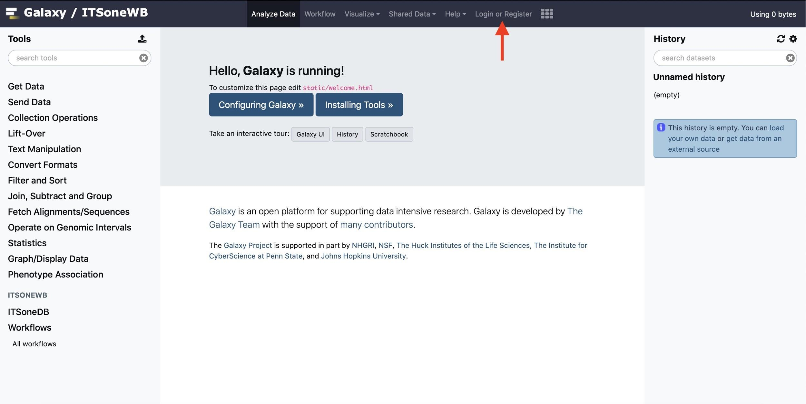
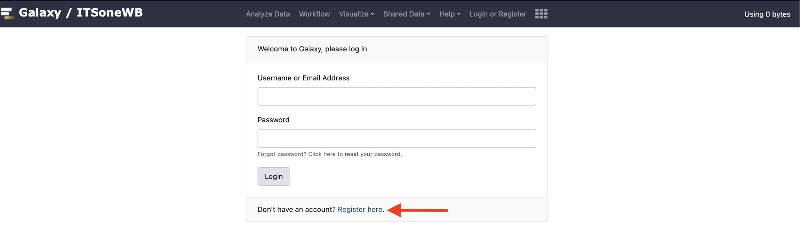
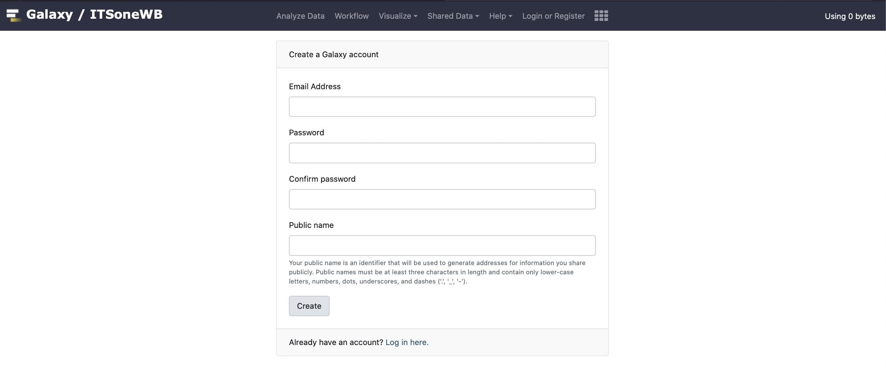

How to register in ITSoneWB
===========================

As explained above, the access to ITSoneWB is not restricted and anonymous users are allowed. Nonetheless, the registration is highly recommended and, currently, does not require any approval from the
service provider.

In order to register to ITSoneWB, the user needs just to access the home page by using the `link <http://itsonewb.cloud.ba.infn.it/galaxy>`_ and select "*Login or register*" (red arrow in the Supplementary Figure 2).

*Supplementary Figure 2: ITSoneWB home page. The red arrow points to "Login or register".*

Once the login page is available, the registered users need just to fill the fields with the chosen username (or email) and password, respectively, and push "*Login*". Unregistered users may proceed to the registration portal by clicking "*Register here*" (Supplementary Figure 3).

*Supplementary Figure 3: ITSoneWB login page. The red arrow points to the registration page link.*

To complete the registration, it is required to fill the fields with the information listed below (Supplementary Figure 4):

#.  Email Address: a valid email address.

#.  Password: a password allowing access to the account. Even if there are no particular requirements for password selection, the application of general `advices <https://www.howtogeek.com/195430/how-to-create-a-strong-password-and-remember-it/>`_ is suggested.

#.  Confirm Password: just write again the chosen password.

#.  Public Name: a username associated with the account.

By clicking "*Create*", the account will be automatically created and the user logged in to ITSoneWB.

*Supplementary Figure 4: Registration page.*

The user is allowed to choose among the available pipelines and services, all interfaced with the release 1.138 of ITSoneDB, by accessing to the "ITSoneWB section". Following a list of guidelines to use the tools.
