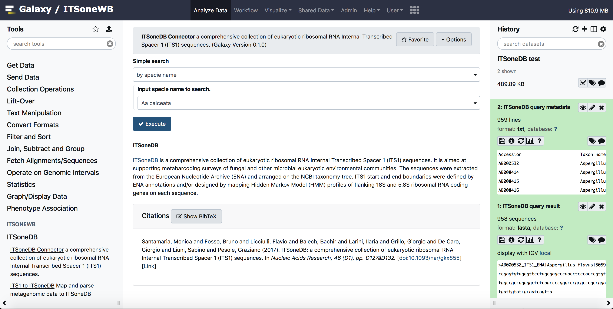

.. itsonewb documentation master file, created by
   sphinx-quickstart on Tue Apr 27 18:14:36 2021.
   You can adapt this file completely to your liking, but it should at least
   contain the root `toctree` directive.

Welcome to itsonewb's documentation!
====================================

The amplicon-based metagenomic analysis (i.e. DNA metabarcoding), represents a powerful tool to rapidly, efficiently and cheaply investigate large microbial communities. The growing interest in its application results in a concomitant increase of appropriate resources designed to manage and analyze data in FAIR-compliant way (Wilkinson et al., 2019).

In this context, ITSoneWB (ITSone WorkBench) represents a well-defined environment collecting and integrating the high quality ITS1 reference collection in ITSoneDB (Santamaria et al., 2017) with DNA metabarcoding well-established analysis pipelines and new tools in an easy-to-use service addressing the eukaryotic domain of life. Specifically, BioMaS, QIIME (Caporaso *et al.*, 2010), QIIME2 (Bolyen *et al.*, 2019) Mothur (Schloss *et al.*, 2009) pipelines were included and new tools to infer the ITS1 *Barcoding gap and PCR primers pair* in a user defined taxonomic range and to identify ITS1 regions in shotgun metagenomic data were designed, developed and deployed in a Galaxy environment.

.. toctree::
   :maxdepth: 2
   :caption: General Information

   intro.rst
   auth.rst
   references.rst

.. toctree::
   :maxdepth: 2
   :caption: Tools

   itsonedb/itsonedb.rst
   biomas/biomas.rst
   primer_design/primer_design_tools.rst
   barcoding_gap.rst
   itsonewb_docker.rst

Indices and tables
==================

* :ref:`genindex`
* :ref:`modindex`
* :ref:`search`
