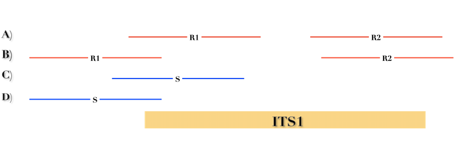

Introduction
============

The amplicon-based metagenomic analysis (i.e. DNA metabarcoding), represents a powerful tool to rapidly, efficiently and cheaply investigate large microbial communities. The growing interest in its application results in a concomitant increase of appropriate resources designed to manage and analyze data in FAIR-compliant way (Wilkinson et al., 2019).

In this context, ITSoneWB (ITSone WorkBench) represents a well-defined environment collecting and integrating the high quality ITS1 reference collection in ITSoneDB (Santamaria et al., 2017) with DNA metabarcoding well-established analysis pipelines and new tools in an easy-to-use service addressing the eukaryotic domain of life. Specifically, BioMaS, QIIME (Caporaso *et al.*, 2010), QIIME2 (Bolyen *et al.*, 2019) Mothur (Schloss *et al.*, 2009) pipelines were included and new tools to infer the ITS1 *Barcoding gap and PCR primers pair* in a user defined taxonomic range and to identify ITS1 regions in shotgun metagenomic data were designed, developed and deployed in a Galaxy environment.

Galaxy environment setting
--------------------------

The Galaxy virtual instance hosting the ITSoneWB was deployed on the INFN-Bari ReCaS (Recas - ReCaS Bari, 2021) cloud facility running OpenStack (Open Source Cloud Computing Infrastructure, 2021). A dedicated tenant was created to host the workbench instance. Finally, a Galaxy virtual cluster was deployed to develop the workbench, exploiting the resources of the INFN-Bari cloud site, consisting in a front-end server running Galaxy 19.05 and the slurm server and 2 Worker Node (WN), each fit out with 8 CPUs and 16 Gb RAM and running CentOS 7. The TOSCA (TOSCA Simple Profile in YAML Version 1.0, 2021) templates used to deploy the cluster are hosted on `github <https://github.com/ibiom-cnr/itsonewb/tree/master/galaxy-deployment>`_.

A comprehensive description of Galaxy environment deployment is available in (Tangaro *et al.*, 2020).

Tools and Database implementation and deployment
------------------------------------------------

ITSoneDB 
^^^^^^^^

ITSoneDB is available, as a free web service, `here <http://itsonedb.cloud.ba.infn.it/>`_ where data query and download are enabled through a simple web-interface, whereas metadata can be accessed by cross-linking to ENA. ITSoneDB is updated every 6 months and always curated.

It collects ITS1 sequences and the associated taxonomic annotation originated from European Nucleotide Archive (ENA). The annotation of ITS1 boundaries were also refined or de novo inferred by using a reference-based approach relying on the mapping of the Hidden Markov Models (HMM) relative to conserved ribosomal gene for RNA 18S (Rfam accession: RF01960) and 5.8S (RF00002) on the original sequence.

Moreover the integration of ITSoneDB with the Marine reference databases (Klemetsen *et al.*, 2018) is ongoing within the ELIXIR EXCELERATE Projects and it is already implemented into the MGnify pipeline (Mitchell *et al.*, 2020) at EMBL-EBI as reference ITS1 collection and in META-pipe (Robertsen *et al.*, 2016). All these actions aimed at increasingly enhance its usefulness, exposure and interoperability in agreement to the FAIR (Wilkinson *et al.*, 2016) data principles, thereby improving its long-term value and reuse.

The same query criteria available in ITSoneDB have been implemented in ITSoneWB in order to retrieve data by accession number (i.e. by using ENA accession number) and/or by taxon name (e.g. species name).

ITSoneDB vs. shotgun mapping tool
^^^^^^^^^^^^^^^^^^^^^^^^^^^^^^^^^

The easiest way to taxonomically classify shotgun metagenomic data is to search for DNA barcoding makers , such as 16S and 18S ribosomal RNA genes (Bremges *et al.*, 2020) and ITS sequences.

We developed a Python script allowing users to search for ITS1 regions in shotgun metagenomic data. In particular, the script automatically aligns single-end (SE) and paired-end (PE) reads against ITSoneDB by exploiting bowtie2, in both end-to-end (similar to a global alignment) and local modality. The resulting alignments are then filtered according to query coverage (default ≥70%) and similarity (default ≥97%). Finally, a list of ITS1 sequences are returned.

It is important to note that the choice between the single-end and the paired-end mapping may influence the results. In particular, in PE mapping both the reads must pass the query coverage threshold.

*Supplementary Figure 1: A representation of the implemented mapping schema. Red and blue lines correspond, respectively, to paired- and single-end reads. For PE reads, R1 and R2 represents the forward and the reverse reads, respectively.*

In Supplementary Figure 1 four hypothetical mapping situations are shown. In the first one (A) both the PE mates align to the ITS1 reference for more than 70% of their length, so assuming the identity percentage (measured as the mean of the similarity obtained by each mate) is higher than the imposed threshold, this alignment is retained. In the second case (B), the R1 aligns to the reference for less than 70% and consequently the PE alignment is completely filtered-out. Single-end cases are more simple because we check the requirements for each read independently (C is retained and D is not).

BioMaS (Bioinformatic analysis of Metagenomic ampliconS)
^^^^^^^^^^^^^^^^^^^^^^^^^^^^^^^^^^^^^^^^^^^^^^^^^^^^^^^^

BioMaS (Fosso *et al.*, 2015) was released in 2015 as a user-friendly pipeline designed to assess the microbiome composition directly from raw DNA metabarcoding HTS data. Its purpose was to support the metabarcoding investigation without requiring any installation or configuration step by users, but just offering an already well-defined and configured environment by using Galaxy (Blankenberg *et al.*, 2010), a WFMS (Workflow management system). It was designed to perform the direct taxonomic binning of metabarcoding data. It merges the Paired End (PE) reads and trims low quality regions of unmerged reads. Its workflow has been proven to carry out a very accurate taxon binning, outperforming both QIIME and Mothur. Moreover, it is designed to work both with long amplicons (e.g. ITS1) where the PE reads merging is not always possible or efficient. Indeed, BioMaS is able to map metagenomic sequences to the reference collection both in PE (unmerged reads) and SE (merged reads) mode.

We developed the Galaxy wrapper file, responsible to set BioMaS options, run BioMaS and produce the outputs, while each step of the pipeline is called through a python script. All dependencies are automatically solved exploiting CONDA through Galaxy. ITSoneDB is used as the default reference database.

QIIME (Quantitative Insight Into Microbial Ecology)
^^^^^^^^^^^^^^^^^^^^^^^^^^^^^^^^^^^^^^^^^^^^^^^^^^^

QIIME (Caporaso *et al.*, 2010) is probably the most used pipeline to address the analysis of microbial data with more than 15,000 citations (Scopus). It implements tools for NGS data quality check, OTU-picking, Beta and Alpha diversity analysis and statistical test. Its deployment in the ITSoneWB has been obtained through Galaxy ShedTools.

QIIME2 (Quantitative Insight Into Microbial Ecology 2)
^^^^^^^^^^^^^^^^^^^^^^^^^^^^^^^^^^^^^^^^^^^^^^^^^^^^^^

QIIME2 (Bolyen *et al.*, 2019) is a suite of tools and scripts designed for the analysis of microbial data from raw sequencing data import to statistical analysis of the obtained results. It has currently replaced QIIME by improving both the suite installation and usage. Moreover, according to FAIR principles and data traceability, it implements an "artifact" based approach allowing to trace the data provenance and tools application. The version available on the workbench is installed through the Galaxy ShedTools.

Mothur
^^^^^^

Mothur (Schloss *et al.*, 2009) represents another well-established and widely used pipeline for the analysis of metabarcoding data. It has been installed in the workbench through Galaxy ShedTools.

Mopo16S (Multi-Objective Primer Optimisation for 16s experiments)
^^^^^^^^^^^^^^^^^^^^^^^^^^^^^^^^^^^^^^^^^^^^^^^^^^^^^^^^^^^^^^^^^

The Mopo16s (Sambo *et al.*, 2018) tool has been designed to maximize the primer design process on 16S rRNA sequences and released as a free software under the GNU General Public License. It has been deployed in ITSoneWB by optimizing its parameters to process ITS1 reference sequences collected in ITSoneDB.

Actually, this tool is not currently available as a conda package, therefore we built it from scratch, against the seqan library v2.2.1. The tool was ported to Galaxy and deployed on ITSoneWB. Moreover, in order to allow the user to compute the primer design in a specific clade, a tool to prepare a set of input reference sequences was developed and ported to Galaxy.

Barcoding gap
^^^^^^^^^^^^^

The Barcoding gap has been defined as the difference between the observed largest intraspecific and smallest inter-specific genetic distances (e.g. ITS1 sequences belonging to two *Aspergillus* species) (Meyer and Paulay, 2005). It is fundamental to evaluate the ability of a specific barcode to discriminate between closely related species and the existence of a barcoding-gap allows to verify it. 

In order to evaluate the ITS1 efficiency in species or genus discrimination, we developed a tool to infer the barcoding gap in a user defined taxonomic clade.

The barcoding gap inference relies on the comparison of intra- and inter- group genetic distances, so it is necessary to compute pairwise sequence alignments and genetic distance inference. This operation may be computationally expensive especially when hundreds of sequences need to be compared (e.g. considering 100 sequences we need to perform $\frac{100!}{2!(100 - 2)!}$combinations equal to 4,950 pairwise alignments) and this represent a critical bottleneck if performed whenever the user requests the calculation for a large taxonomic range. In order to streamline this step, all the required pairwise comparison and genetic distances were precomputed and results stored in a tabular file.

In detail, a Python-based workflow was developed to perform pairwise sequences alignments and compute genetic distance inference through the following steps:

- all the ITSoneDB sequences lacking complete taxonomic information were discarded (i.e. we retained sequences taxonomically annotated to both genus and species level). This procedure was necessary to avoid any error due to a taxonomic misclassification;

- Sequences were split according to the species name;

- A species dereplication was performed to reduce the computational requirements. For identical sequences the distance is settled to 0.

- Dereplicated sequences were then grouped according to their family;

- Pairwise alignments were performed by using the Needleman-Wunsch algorithm (global alignment). Genetic distance was measured as the number of mismatch normalized by the alignment length;

- All the computed distances were stored in a csv (i.e. comma separated values) file collecting also the sequences taxonomic information.

The barcoding gap was then computed in the user selected clade by using two approaches:

#. The largest intra-group genetic distance was compared to the smallest inter-group one;

#. The mean intra- and inter- group distances were compared.

Currently, this tool allows to measure the barcoding gap at genus and species level.

Computing and Data Policy
-------------------------

ITSoneWB is available `here <http://itsonewb.cloud.ba.infn.it/galaxy>`_ through both registered and anonymous access. Aside from the access modality, the user can exert the whole set of implemented utility and pipelines. Nonetheless different computational capacity, storage and data latency are assigned to registered and anonymous users. In particular, 4 parallel jobs and 1 latency month and 2 parallel jobs, 500 Mb and 3 latency days are ensured to registered and anonymous users, respectively.

The anonymization of log files ensures the compliance to the European General Data Protection Regulation (GDPR).
