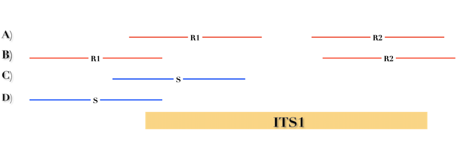

ITSoneDB
========

The ITSoneDB tool embeds two services: **ITSoneDB Connector** and **ITSoneDB vs. shotgun mapping tool**.

ITSoneDB Connector
------------------

The ITSoneDB Connector allows querying ITSoneDB by using an API service with the same query schema available at the database website. In particular, it is possible to access the ITSoneDB entries by using the following parameters: species name, taxon name and entry accession (Supplementary Figure 5*)*.

*Supplementary Figure 5: : A snapshot of the ITSoneDB connector Service. ITSoneDB entries are accessible by using species name, taxon name and entry accession.*

In order to streamline querying by using both species and taxon names an interactive drop-down menù is available (Supplementary Figure 5). For instance, in *Figure ITSoneDB Connector 2* ITSoneDB is accessed by using the species name *Aspergillus flavus*.

*Supplementary Figure 6: The ITSoneDB connector service suggests a list of possible species names according to the user typing.*

As the species name selection is completed by clicking the "execute" button, the data retrieval from ITSoneDB is executed Supplementary Figure 7).

*Supplementary Figure 7: Following the query parameters selection ITSoneDB is accessed by clicking the "Execute" button.*

The query retrieves ITS1 fasta sequences and the contextual metadata. As exemple, 958 ITS1 belonging to *Aspergillus flavus* are available in ITSoneDB and retrieved. The metadata are arranged in a tabular file containing 5 fields:

-   Accession: ENA Accession number from which the ITSoneDB sequence was obtained;

-   Taxon name: The ITS1 taxonomic given name;

-   ITS1 localization: the method used to infer the ITS1 location (ENA or/end HMM);

-   Sequence description: the description of the sequences retrieved from the original ENA entry.

This information are downloadable as a textual file that can be imported in Excel.

*Supplementary Figure 8: A snapshot of the obtained metadata file.*

ITSoneDB vs. shotgun mapping tool
---------------------------------

The ITS1 *shotgun mapping* service allows to identify and eventually taxonomically classify ITS1 regions in metagenomic shotgun data.

*Supplementary Figure 9: A snapshot of the tool setup mask.*

*ITSoneDB vs. shotgun mapping tool* is able to analyse both single-end (SE) and paired-end (PE) fastq files. It exploits query sequence mapping on the ITSoneDB collection by using bowtie2, in both end-to-end (similar to a global alignment) and local modality. The resulting alignments are then filtered according to query coverage and similarity. Finally, a list of ITS1 sequences are returned.

It is important to note the choice between the single-end and the paired-end mapping may influence the results. In particular, in PE mapping both the reads must pass the query coverage threshold.

*Supplementary Figure 10: A schematic representation of the mapping schema implemented in the tool. Red and blue lines correspond, respectively, to paired- and single-end reads. For PE reads, R1 and R2 represents the forward and the reverse reads, respectively.*

In Figure *upplementary Figure 10* 4 hypothetical mapping situations are  represented. In the first one (A) both the PE mates align to the ITS1 reference for more than 70% of their length, so assuming the identity percentage (measured as the mean of the similarity obtained by each mate) is higher than the imposed threshold, this alignment is retained. In the second case (B), the R1 aligns to the reference for less than 70% and consequently the PE alignment is completely filtered-out. Single-end cases are more simple because we check the requirements for each read independently (C is retained and D not).

Taking into account the mapping and filtering modalities, the user needs to choice between the following parameters:

-   Single or Paired, file or collection: type of input files;

-   Bowtie 2 indexes: ITSoneDB reference collection;

-   Identity percentage threshold: the identity percentage filtering threshold to consider the alignment relevant (default ≥ 97%);

-   Coverage of the query sequence: the query coverage filtering threshold to consider the alignment relevant (default ≥ 70%);

-   Number of bowtie2 matches: maximum number of relevant alignments retrieved per each query sequence (or paired-end sequence).

In *Supplementary Figure 10*, a simulation of single-end data analysis by using default parameters is shown.

The result of the analysis is a tubular text file listing the query sequences matching with ITS1 sequences.
