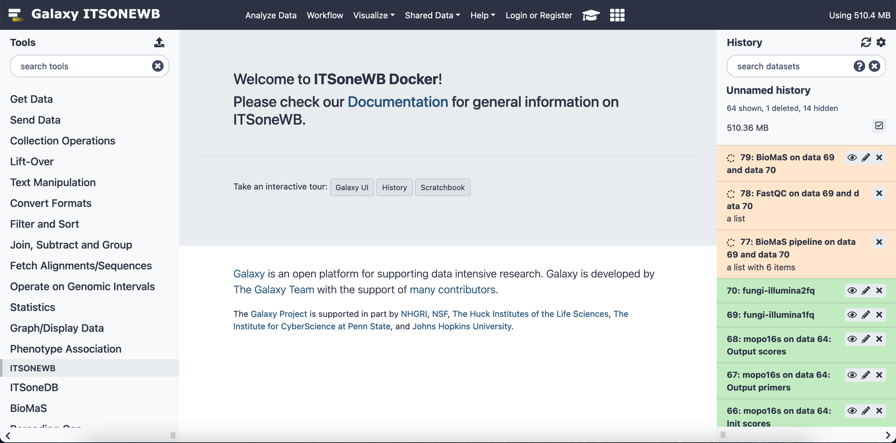

ITSoneWB Galaxy Docker
======================

Each ITSoneWB tool is available as Galaxy tool, standalone tool and packaged as Docker Container. Also Reference data are available and downladable.

Nevertheless, to foster the possibility to install your own copy of ITSoneWB we packaged the whole Galaxy environment as a Docker Container, exploting the `official Galaxy Docker image <https://github.com/bgruening/docker-galaxy-stable>`_, hosted on `DockerHub <https://hub.docker.com/r/ibiomcnr/barcoding-gap>`_.

The ITSoneWB Galaxy Docker comes with its reference data, using the **Elixir Italy CVMFS repository**.

To run the container:

::

  docker run --privileged --name itsonewb -d -p 8080:80 -p 8021:21 -p 8022:22 -v /export/galaxy_storage/:/export ibiomcnr/itsonewb

#. The option ``--privileged`` is mandatory to properly mount the reference data.

#. We strongly suggest to mount an external directory in the docker container with the ``-v`` option, as in the example: ``-v /export/galaxy_storage/:/export``, where ``/export/galaxy_storage/`` is the local storage and ``/export`` is the mountpoint inside the docker container.

#. ITSoneWB will be available on ``<IP ADREESS>:8080``.

.. note::

   The docker container has been tested on Ubuntu 20.04 and Centos 7.

Troubleshooting
---------------

We experienced `this issue <https://github.com/bgruening/docker-galaxy-stable/issues/575>`_  during the ITSoneWB docker development. To avoid it we recommend to start with a clean directory and mount it to ``/export`` using the  ``-v`` option.

If the problem persists try to switch to **devicemapper** `storage driver <https://docs.docker.com/storage/storagedriver/device-mapper-driver/#activate-the-devicemapper-after-reboot>`_
